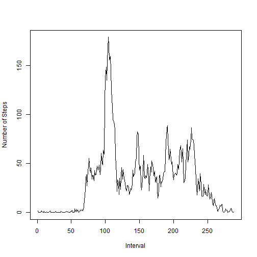
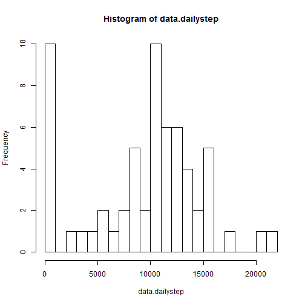
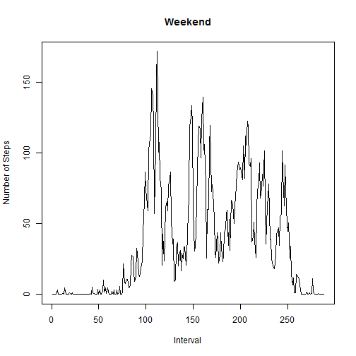
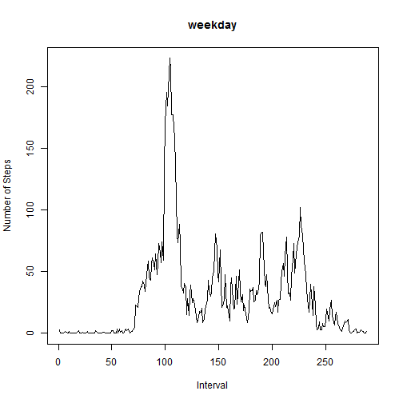

---
Marcos Lodis
Input: activity.csv
Output: html_document
---
# Reproducible Research: Peer Assessment 1

Loading and preprocessing the data

```r
setwd("C:\\Users\\Marcos\\Desktop\\peer assigment 1")
data<-read.csv("activity.csv",header=T)
```

Process the raw data

```r
data$date<-as.Date(data$date)
data.bydate<-subset(data,date==as.Date("2012-10-01"))[,1]
r.names<-subset(data,date==as.Date("2012-10-01"))[,3]
for(i in 1:60){
data.temp<-subset(data,date==as.Date(i,origin="2012-10-01"))[,1]
  data.bydate<-data.frame(data.bydate,data.temp)
}
colnames(data.bydate)<-c(1:61)
row.names(data.bydate)<-r.names
```

Histogram of the total number of steps taken each day

```r
data.dailystep<-colSums(data.bydate,na.rm=T)
hist(data.dailystep,breaks=20)
```

 

Mean and Median of the total number of steps taken each day

```r
mean(data.dailystep,na.rm=T)
```

```
## [1] 9354
```

```r
median(data.dailystep,na.rm=T)
```

```
## [1] 10395
```

Average daily activity pattern based on 5-minute interval

```r
data.dailyave<-rowSums(data.bydate,na.rm=T)/61
plot(data.dailyave,type="l",xlab="Interval",ylab="Number of Steps")
```

 

```r
max(data.dailyave,na.rm=T)
```

```
## [1] 179.1
```

```r
which.max(data.dailyave)
```

```
## 835 
## 104
```

```r
data.dailyave[104]
```

```
##   835 
## 179.1
```
The 104th Interval with index 835,on average across all the days in the dataset, contains the maximum number of steps 179.1.

Calculate and report the total number of missing values in the dataset.
Fill the missing values in the dataset with the mean for that 5-minute interval

```r
count<-0
for(i in 1:288)
  for(j in 1:61){
    if(is.na(data.bydate[i,j])){
      count=count+1
      data.bydate[i,j]=data.dailyave[j]
    }
    }
count
```

```
## [1] 2304
```
The total number of missing values in the dataset is 2304.

Histogram, Mean, and Median of the total number of steps taken each day for the new set of data with NA replaced

```r
data.dailystep<-colSums(data.bydate)
mean(data.dailystep)
```

```
## [1] 9375
```

```r
median(data.dailystep)
```

```
## [1] 10395
```

```r
hist(data.dailystep,breaks=20)
```

 
The mean is large. The median and histogram is the same.
This is because we use daily average in that 5-minutes interval to replace the missing date.

Create a new factor variable in the dataset with two levels - "weekday" and "weekend" indicating whether a given date is a weekday or weekend day.

```r
data$week<-"weekday"
for(i in 288*61){
  ##data[i,]$Week=weekdays(data[i,]$date)
}
```
5-minute interval (x-axis) and the average number of steps taken, averaged across all weekday days or weekend days (y-axis).

```r
data.weekday<-data.bydate[,1:5]
data.weekend<-data.bydate[,6:7]
for(i in 1:54){
  if(i%%7==6|i%%7==0)
    data.weekend<-data.frame(data.weekend,data.bydate[,i])
  else data.weekday<-data.frame(data.weekday,data.bydate[,i])
}
colnames(data.weekend)<-c(1:16)
colnames(data.weekday)<-c(1:45)
data.weekendave<-rowSums(data.weekend)/16
plot(data.weekendave,type="l",xlab="Interval",ylab="Number of Steps",main="Weekend")
```

 

```r
data.weekdayave<-rowSums(data.weekday)/45
plot(data.weekdayave,type="l",xlab="Interval",ylab="Number of Steps",main="weekday")
```

 
